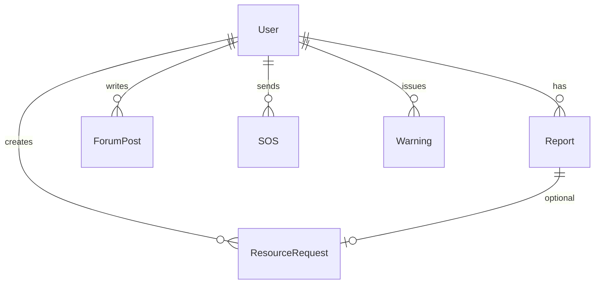

# Coast-Kavach Backend (NestJS + Prisma + PostGIS)

Production-grade backend for Coast-Kavach: versioned REST API, JWT auth, RBAC, Swagger, queues, and i18n-ready error handling.

## Quick Start

1. Environment
```
cp .env.example .env
```
Set `DATABASE_URL`, `JWT_SECRET`, `REDIS_URL`, `S3_*`.

2. Install
```
npm install
```

3. Database
```
npx prisma generate
npx prisma migrate dev --name init
npm run seed
```

4. Run
```
npm run dev
# Swagger at http://localhost:4000/api/docs
```

## Scripts
- dev: watch mode
- build/start: production
- prisma:generate/migrate/deploy
- seed: demo data

## Structure
```
src/
  modules/
    app.module.ts
    health/
    auth/
    user/
prisma/
  schema.prisma
  seed.ts
```

## ERD (mermaid)


## Notes
- All endpoints under `/api/v1` and documented with Swagger.
- Add PostGIS extension to your DB (see migration).
- Queue (BullMQ) and i18n to be wired next.
